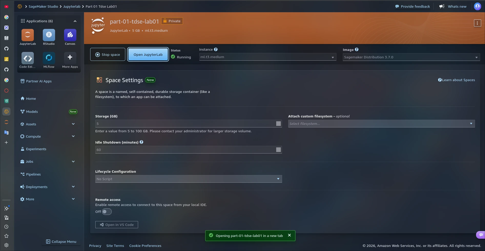
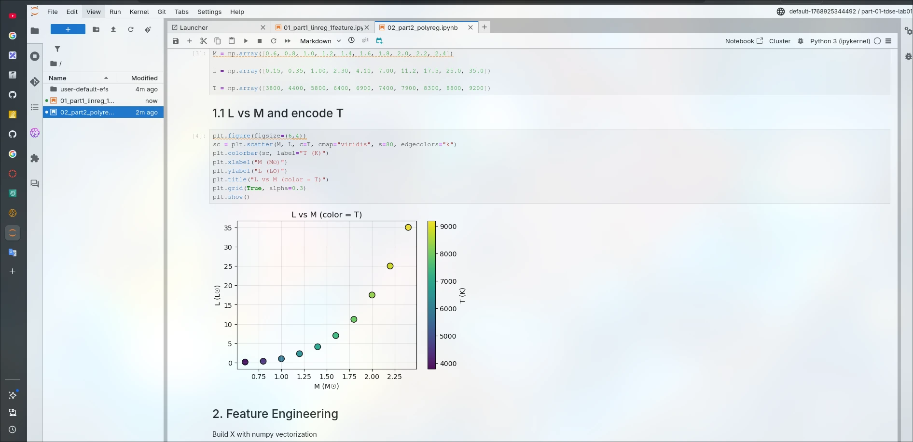
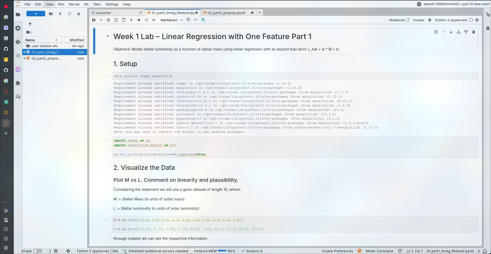
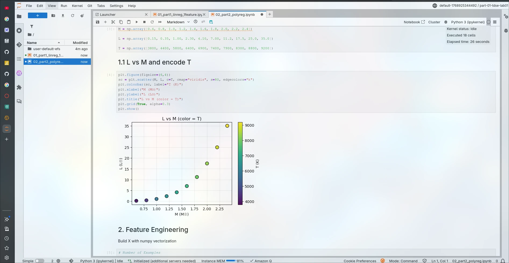
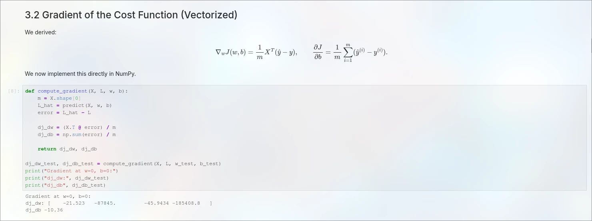

# Stellar luminosity - Linear and Polynomial Models for Regression

Working repository with notebooks to practice linear regression (single feature) and polynomial regression using stellar luminosity data.

## Description
This project contains Jupyter Notebook exercises to explore regression models on astronomical data. It includes:
- Linear regression with a single feature.
- Polynomial regression.

## Getting Started
These instructions will help you run the notebooks locally for development or practice.

### Prerequisites

- Python 3.10+ (or the version you use in your environment)
- Jupyter Notebook or JupyterLab
- Some packages of Python (e.g., `numpy`, `matplotlib`)

### Installation

1. Clone the repository.

2. Create and activate a virtual environment.

## Usage
Open the notebooks in the suggested order:
- 01_part1_linreg_1feature.ipynb
- 02_part2_polyreg.ipynb

Run the cells to reproduce the results.

## AWS SageMaker Execution Evidence

To upload the notebooks to SageMaker, the first thing i did was log in to AWS Academy with my institutional credentials. After that, I launched the lab, searched for SageMaker AI, created a new space, launched the instance, waited for it to load, and then uploaded the two notebooks within Jupyter

With both notebooks open in Jupyter, we can select the option to run all cells, restart the environment, and it will run them respectively for each notebook.

Regarding the comparison, both locally and in the SageMaker environment, the only difference was the time i had to wait for the Jupyter instance to be created and opened respectively; when running each cell, it was quite fast.

## Built With
- Python
- Jupyter Notebook

## Authors
- Tulio Riaño Sánchez

## Acknowledgments

This project uses the institutional platform ZIP package that includes four notebooks explaining linear regression.